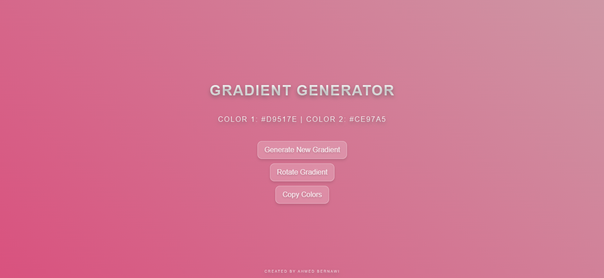

#  Welcome! 

Hi there! I'm [Your Name], a budding web developer exploring the colorful world of front-end development. This is my very first interactive project - a playful gradient generator that creates beautiful color transitions!

## Browser Screenshot 📸

Here's a screenshot of the gradient generator in action:



## What Does It Do? ✨
- Instantly generates gorgeous random gradients
- Displays hex color codes for both colors
- One-click refresh for endless inspiration
- Perfect for designers & developers needing color ideas

## How to Play 🎮
1. **Load the page** - Get surprised by your first random gradient!
2. **Click the magic button** - "Generate New Gradient" creates new combinations
3. **Copy colors** - Use the displayed hex codes in your projects

## Live URL 🌐
Check it out [here](https://ahmedbernawi.github.io/fuzzy-robot/).

## What's Inside 🗂️
```bash
gradient-generator-static
├── index.html        # The party starter!
├── styles            
│   └── style.css     # Where the visual magic happens ✨
├── scripts           
│   └── script.js     # The brain behind the beauty 🧠
└── README.md         # You're reading this! 📖
```

## Why I Built This 🛠️
I wanted to:
- Practice core web technologies (HTML/CSS/JS)
- Create something both functional and beautiful
- Learn about color theory and random generation
- Share a useful tool with fellow beginners

## Want to Contribute? 🌱
Found a bug? Have ideas? As a new developer, I welcome:
- Friendly advice on code improvements
- Design suggestions
- Feature requests
- Encouragement! 💌

Let's connect on [Ahmed.Bernawi](https://www.instagram.com/ahmed.bernawi/)!

*"Colors are the smiles of nature."* - Leigh Hunt
